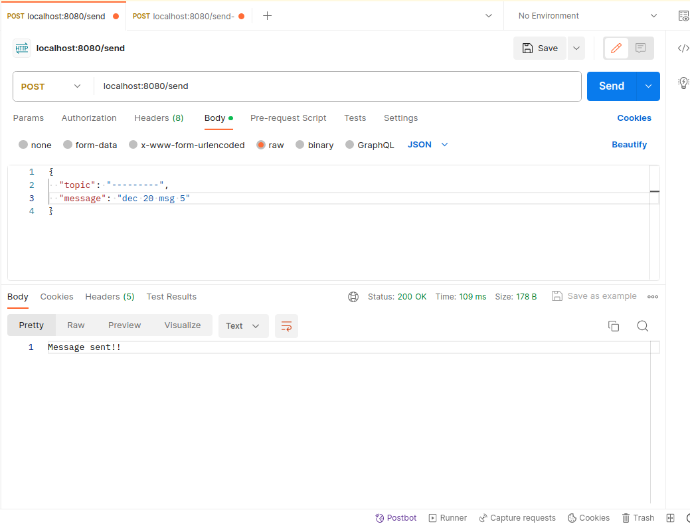
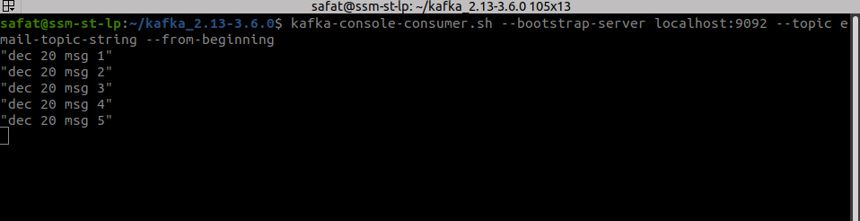
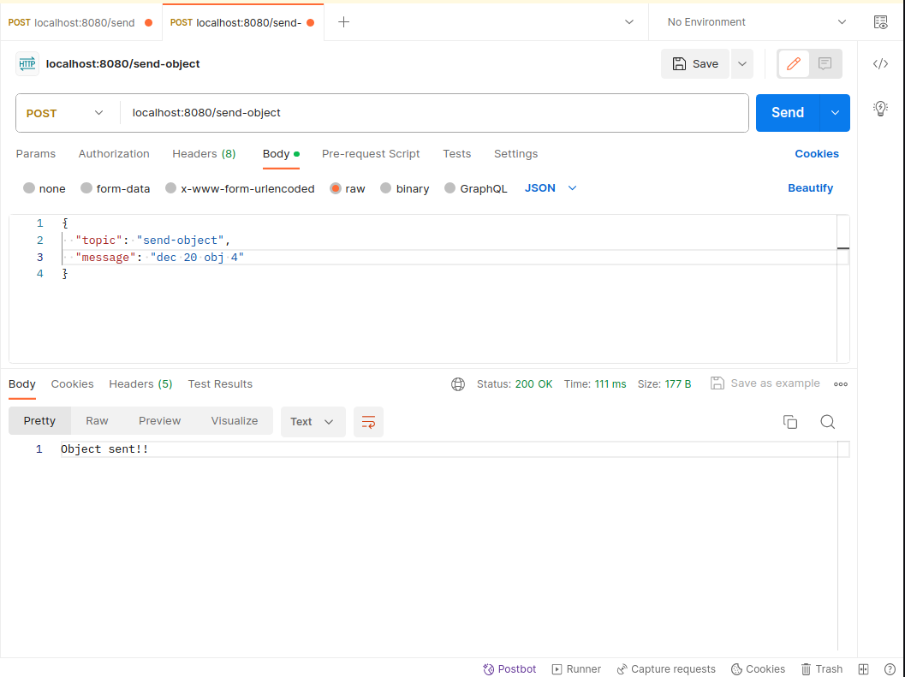
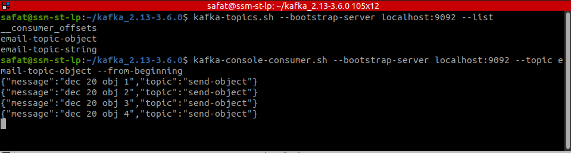

# Kafka-spring-boot-test-service-implementation

This is a spring boot project where a imaginary service named as email-service is done.

## To start the project
Steps
* check the cli_commands.md
* Start the kafka server (using Kraft is recommended)
* Run the app
* hit with postman the following 2 APIs that I have created and check the results.

## Outputs

Sending string from the payload to kafka  

Now Kafka in kafka the message(string) will be look like this:

Sending object from the payload to kafka  

Now Kafka in kafka the message(object) will be look like this:

